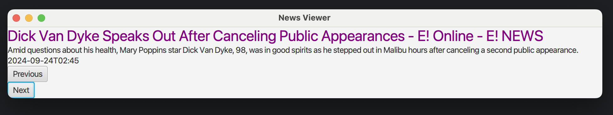
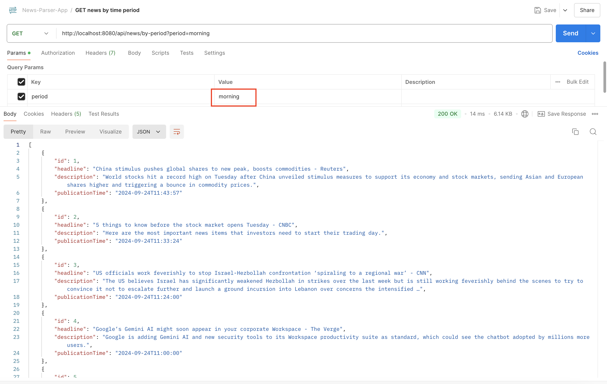
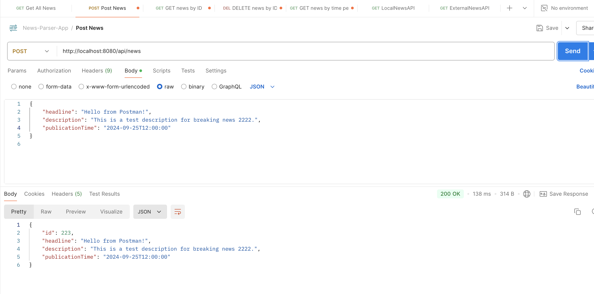
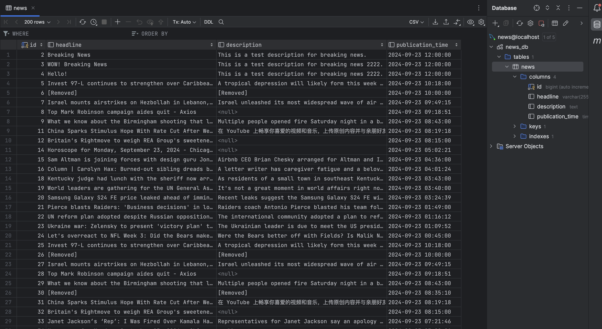

# **NewsParserApplication Documentation**

## **Overview**
`NewsParserApplication` is a Spring Boot application that fetches news from an external API, stores it in a MySQL database (or H2 for local testing), and displays it in a JavaFX-based client. The application uses Quartz Scheduler to fetch new news articles every 20 minutes.

## **Features**
- Fetches news from an external API (e.g., NewsAPI.org).
- Stores news articles in MySQL or H2 database.
- Displays news in a JavaFX GUI, allowing users to navigate between news articles.
- Filters news based on time periods: morning, day, or evening.
- Scheduled news parsing every 20 minutes using Quartz Scheduler.
- Modular structure with separate backend and frontend components.

## **Prerequisites**
### **Backend:**
- Java 17 or later
- Maven 3.6.0 or later
- MySQL or H2 database (for testing)

### **Frontend:**
- JavaFX SDK 17.0.12

### **External API:**
A valid API key for NewsAPI.org for fetching news.

## **Installation**
### **1. Clone the repository:**

    git clone https://github.com/your-repo/news-parser-app.git
    cd news-parser-app

### **2. Set up the database:**

- If you're using MySQL:
	- Create a MySQL database named `news_parser_db` (or adjust the name in application.properties).
	- Update the database configurations in `backend/src/main/resources/application.properties`.
- If you're using H2:
	- Use the configuration in `backend/src/main/resources/application-h2.properties` to switch to H2 for testing.

### **3.Configure NewsAPI Key:**

- Add your API key in the `application.properties file`:
    ```
    newsapi.key=your_news_api_key_here
    ```

## **Running the Application**
### **Backend:**	
- 1.Build and run the backend:

```
cd backend
mvn clean install
mvn spring-boot:run
```

- 2.Switching between MySQL and H2:
	- To run with MySQL, use the default `application.properties`.
	- To switch to H2 for local testing, specify the `h2` profile:

```
mvn spring-boot:run -Dspring-boot.run.profiles=h2
```

   - Access the H2 Console:
	- URL: http://localhost:8080/h2-console
	- JDBC URL: jdbc:h2:mem:testdb

### **Frontend (JavaFX Client):**
- 1.Build and run the frontend:

```
cd frontend
mvn javafx:run
```

Ensure the following VM options are set in your IDE or Maven configuration for JavaFX:

```
--module-path /path/to/javafx-sdk/lib --add-modules javafx.controls,javafx.fxml
```

- 2.Using the Application:

	- The JavaFX window will load the news for the "morning" period by default.
	- Navigate between news articles using the Next and Previous buttons.
	- Headline, description, and publication time of each news article will be displayed.
	- You can modify the time period (morning, day, evening) to filter news.

## **Scheduling with Quartz**
The application uses Quartz Scheduler to fetch and store new news articles every 20 minutes.

### **Changing the Schedule:*
You can modify the CRON expression in the QuartzConfig class located in the backend module:

```
.withSchedule(CronScheduleBuilder.cronSchedule("0 0/20 * * * ?"))
```
This CRON expression currently schedules the job to run every 20 minutes.

## **Technologies Used**
### **Backend:**

- Spring Boot
- Spring Data JPA
- Quartz Scheduler
- MySQL / H2
- Lombok
- Jackson for JSON parsing
- Apache HttpClient
- Log4j for logging

### **Frontend:**

- JavaFX
- FXML for UI
- Maven

## **Screenshots**
### **JavaFX Window with News**

### **GET request by period (morning)**

### **POST request to save the news**

### **MySQL db with all news**


